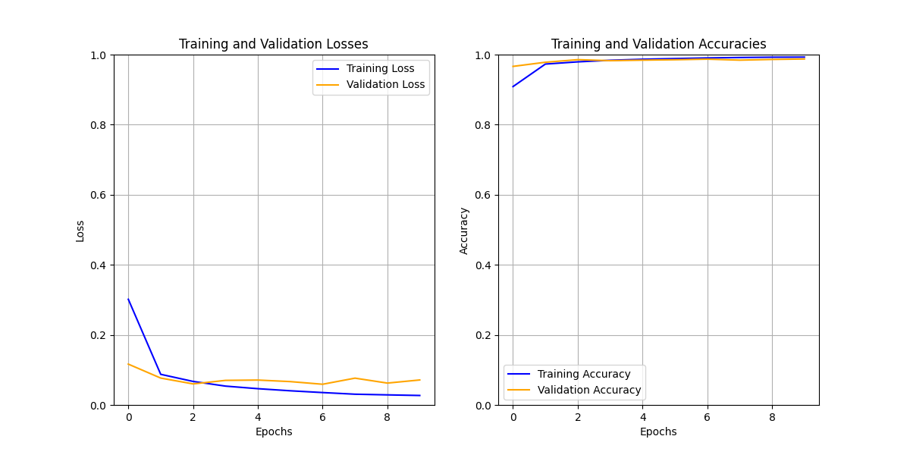
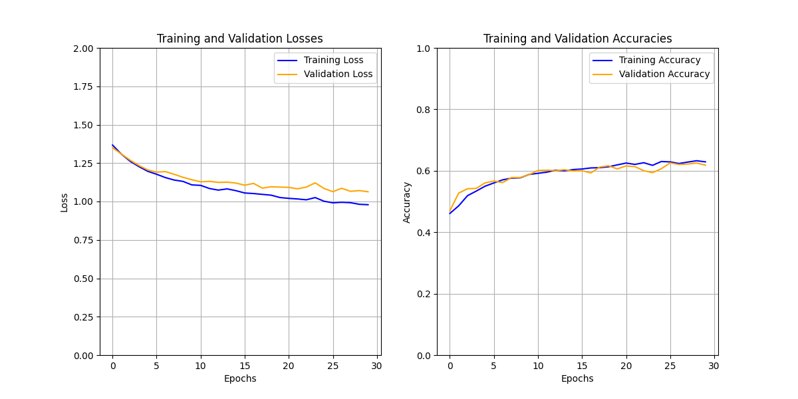
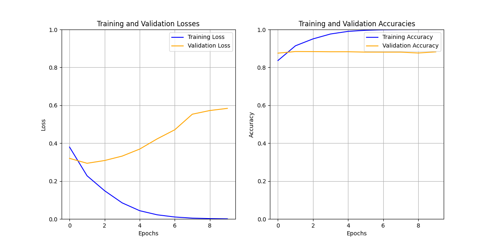

# 🧠 CNN Applications

📺 **Live Demo**: [View on Streamlit](https://bindepzai7-cnn-applications.streamlit.app/)

This project showcases the application of Convolutional Neural Networks (CNNs) to solve different image classification and text classification tasks. Through a series of experiments, I explore how CNNs like **LeNet** and **TextCNN** perform on classic and real-world datasets.

---

## 🔢 Digit Recognition

In this task, I implemented the **LeNet** architecture to classify handwritten digits using the **MNIST** dataset.

- **Architecture**: LeNet  
- **Dataset**: MNIST  
- **Image Size**: 28×28 (grayscale)  
- **Number of Epochs**: 20  

📈 Below is a plot of training and validation performance after 20 epochs:  


---

## 🌿 Cassava Leaf Disease Classification

This task addresses a real-world agricultural problem: identifying diseases in cassava leaves from images. The model is trained to classify leaf images into multiple disease categories.

- **Architecture**: LeNet-style CNN (customized for RGB inputs and larger image size)  
- **Dataset**: Cassava Leaf Disease Dataset  
- **Image Size**: 150×150  
- **Number of Classes**: 5  
- **Number of Epochs**: 30  

📈 Below is a plot of training and validation performance after 30 epochs:  


---

## 💬 Sentiment Analysis

This task showcases the use of **TextCNN**, a Convolutional Neural Network tailored for text classification. The model is trained to classify Vietnamese sentences into **positive** or **negative** sentiments.

- **Architecture**: TextCNN  
- **Dataset**: NTC-SCV (Vietnamese Sentiment Corpus)  
- **Vocabulary Size**: 10,000  
- **Embedding Dimension**: 100  
- **Kernel Sizes**: [3, 4, 5]  
- **Number of Filters**: 100 per kernel size  
- **Number of Epochs**: 10  

📝 The input sentence is tokenized, preprocessed, converted to indices, padded, and passed through the model to infer sentiment.

📈 Below is a plot of training and validation accuracy over epochs:  


---

## 📁 Project Structure

```bash
CNN_Applications/
├── data/
│   └── Demo/                 # Sample demo images for testing
├── model/                    # Trained PyTorch model weights
│   ├── model1.pt             # LeNet for digit recognition
│   ├── model2.pt             # LeNet-style CNN for cassava
│   ├── model3.pt             # TextCNN for sentiment analysis
│   └── vocabulary.pth        # Pre-trained vocabulary for sentiment model
├── Plots/                    # Training/validation plots for each task
├── src/
│   ├── app.py                # Streamlit app entry point
│   ├── lenet_digit_recognition.py
│   ├── lenet_leaf_disease.py
│   ├── textCNN.py            # TextCNN architecture
│   ├── task3_preprocess.py   # Preprocessing logic for sentiment
├── requirements.txt
├── README.md
└── .streamlit/
    └── config.toml           # Streamlit config file
