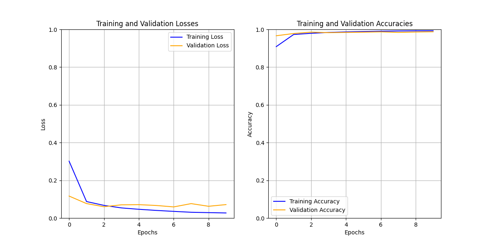

# 🧠 CNN Applications

📺 **Live Demo**: [View on Streamlit](https://bindepzai7-cnn-applications.streamlit.app/)

This project showcases the application of Convolutional Neural Networks (CNNs) to solve different image classification tasks. Through a series of experiments, I explore how CNNs like **LeNet** perform on classic and real-world datasets.

---

## 🔢 Digit Recognition

In this task, I implemented the **LeNet** architecture to classify handwritten digits using the **MNIST** dataset.

- **Architecture**: LeNet  
- **Dataset**: MNIST  
- **Image Size**: 28×28 (grayscale)  
- **Number of Epochs**: 20  

📈 Below is a plot of training and validation performance after 20 epochs:  

---

## 🌿 Cassava Leaf Disease Classification

In this task, I address a real-world agricultural problem: identifying diseases in cassava leaves from images. The model is trained to classify leaf images into several disease categories using CNNs.

- **Architecture**: LeNet-style CNN (customized for RGB inputs and larger image size)  
- **Dataset**: Cassava Leaf Disease Dataset  
- **Image Size**: 150×150  
- **Number of Classes**: 5  
- **Number of Epochs**: 30  

🗂 The dataset is split into training, validation, and testing subsets, and the model's performance is tracked across epochs.

📊 Accuracy and loss plots for both tasks are available in the app, along with downloadable results.

---

## 📁 Project Structure

